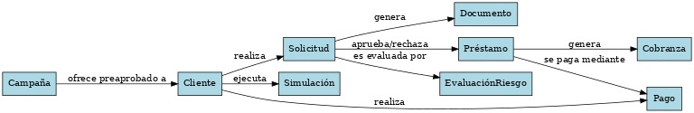

# Grupo 15

Este es el repositorio del *Grupo 15*, cuyos integrantes son:

* Benjamin Alberto Cerda Reyes - Rol 202230519-3
* Jean Paul Alexandre Vergara - Rol 202230562-2
* Vicente Jesús Beiza Silva - Rol 202230516-9 
* Matias Antonio Perelli Parra - Rol 202230525-8
* **Tutor**: Nombre Tutor

## Wiki

> Obtener enlace desde el home de la wiki del repo.

Puede acceder a la Wiki mediante el siguiente [enlace](https://gitlab.inf.utfsm.cl/)

## Videos

> Reemplazar con los enlaces correspondientes

* [Video presentación cliente](https://www.youtube.com)
* [Video presentación avance 1](https://www.youtube.com/)
* Etc ...

## Diagrama de dominio

> Diagrama de dominio del sistema.

## Aspectos técnicos relevantes

_Todo aspecto relevante cuando para poder usar el proyecto o consideraciones del proyecto base a ser entregado_
